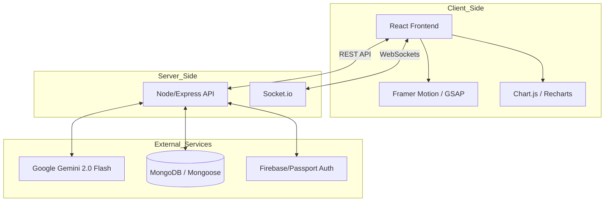
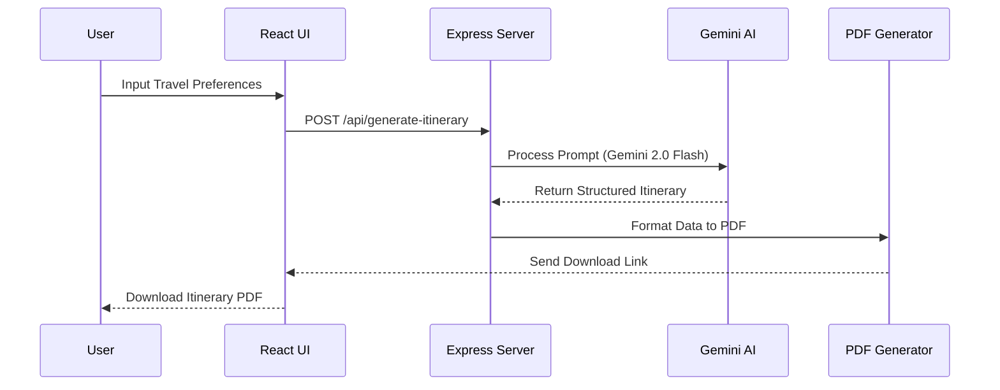

<h1 align="center">🌍 YourTripPlanner</h1>

> **YourTripPlanner** is a comprehensive travel discovery and planning platform designed to help users explore popular Indian tourist destinations with ease. The platform includes smart destination filtering, an AI-powered travel assistant, real-time features, and expense tracking tools, making travel planning simple, fun, and interactive.

<div align="center">
  
</div>

**📊 Project Insights**

<table align="center">
    <thead align="center">
        <tr>
            <td><b>🌟 Stars</b></td>
            <td><b>🍴 Forks</b></td>
            <td><b>🐛 Issues</b></td>
            <td><b>🔔 Open PRs</b></td>
            <td><b>🔕 Closed PRs</b></td>
            <td><b>🛠️ Languages</b></td>
            <td><b>👥 Contributors</b></td>
        </tr>
     </thead>
    <tbody>
         <tr>
            <td></td>
            <td></td>
            <td></td>
            <td></td>
            <td></td>
            <td></td>
            <td></td>
        </tr>
    </tbody>
</table>


## ✨ Features

* 🗺️ **Destination Discovery & Smart Filtering:** Browse a curated list of popular Indian cities beautifully themed with cultural emojis. Instantly filter destinations by region (North, South, East, West).
* 🤖 **AI Travel Assistant:** Powered by **Google Gemini 2.0 Flash**, get personalized travel suggestions, routes, and local insights via a fast, real-time chat interface.
* 📅 **AI-Powered Custom Itinerary:** Generate day-wise personalized itineraries and download them as multi-day PDFs for offline use.
* 💰 **Expense Tracking & Visualizations:** Keep tabs on your travel budget with interactive charts and trackers.
* ⚡ **Real-Time Capabilities:** Built with WebSockets for real-time interactions.


## 💻 Tech Stack

**Frontend:**
* **React.js** – Component-based architecture
* **TailwindCSS & CSS Flexbox** – Responsive and modern styling
* **Framer Motion & GSAP** – Smooth UI animations
* **Chart.js & Recharts** – Interactive expense visualizations

**Backend:**
* **Node.js & Express** – Scalable API service
* **MongoDB & Mongoose** – Database management
* **Socket.io** – Real-time event communication

**AI & Integrations:**
* **Google Gemini 2.0 Flash** – Generative AI for itineraries and chat
* **Firebase & Passport.js** – Authentication handling


## System Architecture
**1. System Integration Flow**


**2. AI Itinerary Generation Sequence**



## 📂 Project Structure

```plaintext
trip-planner/
├── public/                # Static files (HTML, images, favicon)
├── src/                   # Core React frontend source code
│   ├── Components/        # Reusable UI components (Navbar, Footer, Cards)
│   ├── pages/             # React pages (Home, Signup, PlanTrip, etc.)
│   └── index.js           # Entry point for React application
├── backend/               # Node/Express backend server & APIs
├── .vscode/               # Editor-specific workspace settings
├── GEMINI_SETUP.md        # AI Configuration guide
├── CONTRIBUTING.md        # Detailed contribution guidelines
└── README.md              # Project overview
```


## 🚀 Getting Started
Follow these instructions to set up the project locally.

***1. Clone the repository:***

   ```bash
   git clone https://github.com/code-well0/trip-planner.git
   cd trip-planner
   ```

***2. Install dependencies:***

  Open a terminal in the root directory and install the React dependencies:
   ```bash
   npm install
   ```
  Start the development server:
   ```bash
   npm start
   ```
***3. Backend Setup:***
  Open a new terminal window, navigate to the backend folder, and install its dependencies:
  ```bash
  cd backend
  npm install
  ```
  Start the backend server:
  ```bash
  npm start
  ```

***4. Configuration:***

  To configure the Gemini AI Assistant, refer to:
   * [GEMINI\_SETUP.md](./GEMINI_SETUP.md)
  Visit the site:
   * [Live Demo](https://trip-planner-sable-eight.vercel.app/)


<h2 align="center">Open Source Programmes </h2>
<p align="center">
  <b>This project is now OFFICIALLY accepted for:</b>
</p>

<p align="center">
  <a href="https://gssoc.girlscript.tech/"></a>
  <a href="https://dscwoc.dscvitb.in/"></a>
</p>


**Contributing**

We welcome contributions from everyone, especially participants of **GSSoC’25**! 

To contribute:
1. Fork the repository and **Clone** your fork
2. Create a new branch: `git checkout -b feature-name`
3. Make your changes and commit: `git commit -m "Added new feature"`
4. Push to your fork: `git push origin feature-name`
5. Open a **Pull Request**

For detailed instructions and community standards, please check our [CONTRIBUTING.md](./CONTRIBUTING.md) and [Code of Conduct](./CODE_OF_CONDUCT.md).


**Acknowledgements**

- Thanks to all contributors of this project 
- Special shoutout to **GSSoC** and **DSCWoC** for the amazing community and support!
- Built with dedication, collaboration, and lots of chai 


>Thank you once again to all our contributors who has contributed to **trip-planner!** Your efforts are truly appreciated.

<h2 align="center">
<p style="font-family:var(--ff-philosopher);font-size:3rem;"><b> Show some  by starring this awesome repository!
</p>
</h2>


**Suggestions & Feedback**

Feel free to open issues or discussions if you have any feedback, feature suggestions, or want to collaborate!


**Support & Star**

***If you find this project helpful, please give it a star to support more such educational initiatives!***


**📄 License**

This project is licensed under the MIT License - see the [`License`](./License.md) file for details.


<h2 align="center">🧑‍💻 Maintainers & Acknowledgements</h2>
<table align="center">
<tr>
<td>
<a href="https://github.com/code-well0"></a><br><sub><b>Shubrali Jain (Project Admin)</b><br><a href="https://www.linkedin.com/in/shubrali-jain/"></a></sub>
</td>
</tr>
</table>


<h1 align="center"> Give us a Star and let's make magic! </h1>

<p align="center">
     
</p>


<h3 align="center"> 👨‍💻 Built with ❤️ by trip-planner Team </h3>

<h4 align="center">❤️ Shubrali jain and Contributors ❤️ </h4>

<p align="center">
  <a href="https://github.com/code-well0/trip-planner/issues">Open an Issue</a> |
  <a href="https://trip-planner-sable-eight.vercel.app/">Watch Demo</a>
</p>


<p align="center">
  <a href="#top" style="font-size: 18px; padding: 8px 16px; display: inline-block; border: 1px solid #ccc; border-radius: 6px; text-decoration: none;">
    ⬆️ Back to Top
  </a>
</p>


> **"Travel is the only thing you buy that makes you richer." Ready to show off your coding achievements? Get started with trip-planner today! 🚀**


